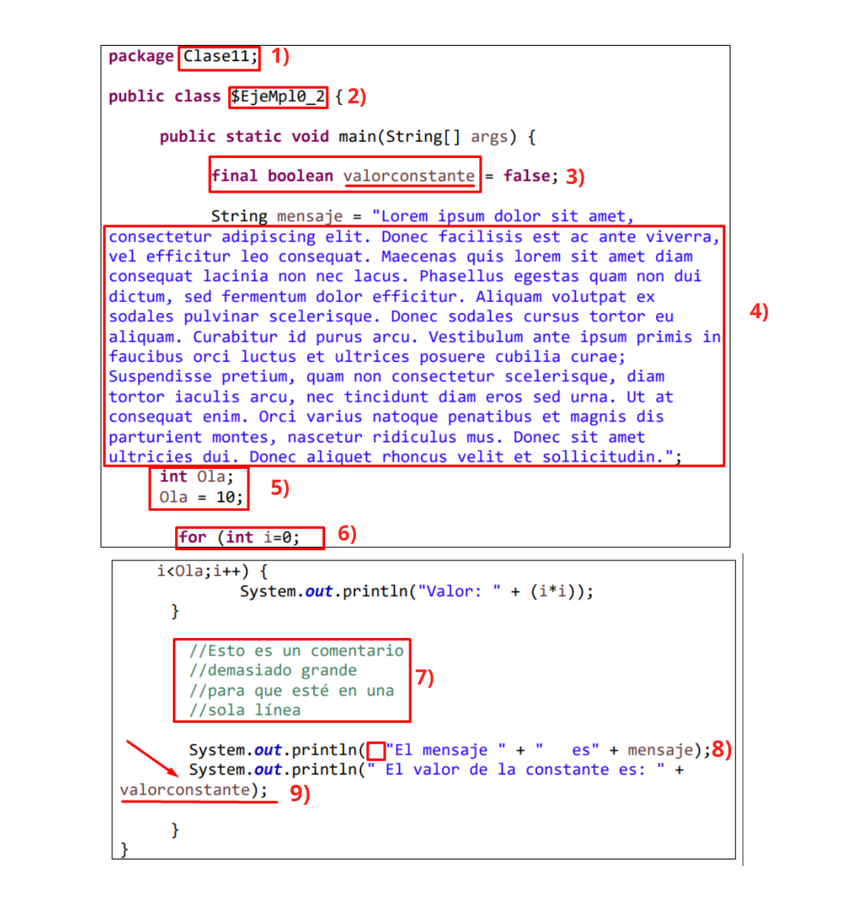

# MÓDULO 4: Fundamentos de Programación en Java ☕

## Ejercicio Grupal 11
## _Estándares, convenciones y estilos de codificación_

---

## Introducción

En este ejercicio trabajamos de manera colaborativa detectando los errores de codificación relacionados con los estándares y las convenciones.

Implementando lo aprendido en el módulo, creamos una nueva clase a partir del ejemplo dado con las correcciones que consideramos pertinentes.

---

### Errores encontrados en el ejemplo:

1. **Package:** El package siempre es minusculas y aca esta en Capitalize Format y tiene el nombre Clase cuando es un package (Ademas debe tener el nombre del paquete no de clase)
2. **Nombre de la Clase:** El nombre de la clase debe ser en Capitalize Format (La priemra letra de la palabra en mayusculas) y no tener $ ni mayusculas entre letras.
3. **Nombre de la Constante:** El nombre valorconstante esta mal, debe ser en mayusculas, por lo que seria VALOR_CONSTANTE.
4. **División de líneas:** El mensaje se separo en diferentes concatenaciones para hacerlo mas legible ya que estaba ordenado por defecto de forma
   erronea, ni siquiera formaba un String.
5. **Nombre de Variable e Inicialización:** Si bien una variable puede llevar cualquier nombre, por convencion se indica que debe ser una palabra existente y descriptiva de lo que se va a operar, sin embargo estaria bien
   Por lo menos escribir hola como corresponde. Ademas de eso la variable se inicializo en la misma linea, consideramos que se ajusta mas asi a los estandares. Se cambio el nombre de la variable de Ola a repetirHasta que es mas descriptivo e indica hasta donde debe repetir el for.
6. **Ciclo For:** El for en si esta bien sintacticamente, el problema radica en que es dificil de leer al estar todos los caracteres de la variable i sin espaciado entre expresioens y operadores.
7. **Comentarios:**
8. **Espacio en blanco:**
9. **División de líneas:**

---

### Integrantes:

| Marines Espaciales:                                             |
| --------------------------------------------------------------- |
| Cristian Trureo |
| Luis Zambrano |
| Marcelo Vargas |
| Leandro Villalba |
