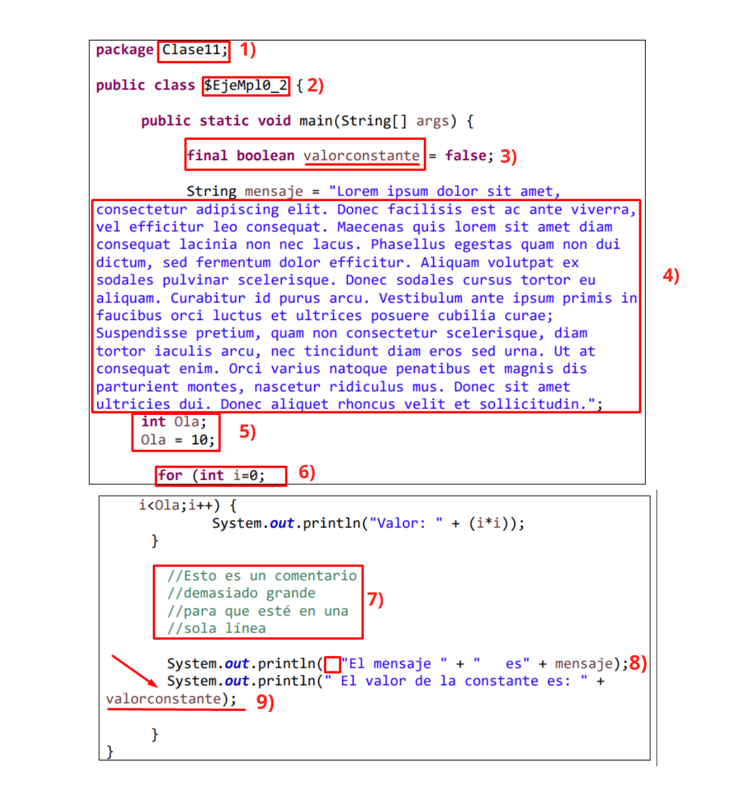

# MÓDULO 4: Fundamentos de Programación en Java ☕

## Ejercicio Grupal 11
## _Estándares, convenciones y estilos de codificación_

---

## Introducción

En este ejercicio trabajamos de manera colaborativa detectando los errores de codificación relacionados con los estándares y las convenciones.

Implementando lo aprendido en el módulo, creamos una nueva clase a partir del ejemplo dado con las correcciones que consideramos pertinentes.

---

### Errores encontrados en el ejemplo:

1. **Package:** El package siempre es minusculas y aca está en Capitalize Format.
2. **Nombre de la Clase:** El nombre de la clase debe ser en Capitalize Format (La primera letra de la palabra en mayúsculas) o PascalCase, y no tener caracteres como la "$", ni mayúsculas entre letras.
3. **Nombre de la Constante:** El nombre valorconstante está mal, al declararse con "final" se asume que es una constante, por lo que sería con mayúscula y separado por guion bajo: VALOR_CONSTANTE.
4. **División de líneas:** El mensaje se separó en diferentes concatenaciones para hacerlo más legible (máximo 80 caracteres), ya que estaba escrito en forma lineal.
5. **Nombre de Variable e Inicialización:** Si bien una variable puede llevar cualquier nombre en camelCase, debe ser una palabra existente y descriptiva de lo que se va a operar. Además, la indentación debe ser igual a la fila superior si son del mismo nivel. Por otro lado, la variable se inicializó en la misma línea, consideramos que se ajusta más asi a los estandares. Se cambió el nombre de la variable de "Ola" a "repetirHasta" que es más descriptivo e indica hasta donde debe repetir el for.
6. **Ciclo For:** El for en sí está bien sintácticamente, el problema radica en que es difícil de leer al estar todos los caracteres de la variable i sin espaciado entre expresiones y operadores. Lo mismo en la instrucción print.
7. **Comentarios:** Aquí es necesario utilizar un comentario en bloque, utilizando /* ... */, y no uno por cada línea.
8. **Espacio en blanco:** Se elimina el espacio delante del string, y se unen las cadenas para tener un código más limpio.
9. **División de líneas:** Se ajusta la instrucción a una sola fila, y además el nombre de la constante: VALOR_CONSTANTE

---

### Integrantes:

| Marines Espaciales:                                             |
| --------------------------------------------------------------- |
| Cristian Trureo |
| Luis Zambrano |
| Marcelo Vargas |
| Leandro Villalba |
